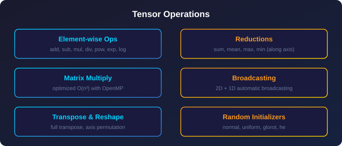
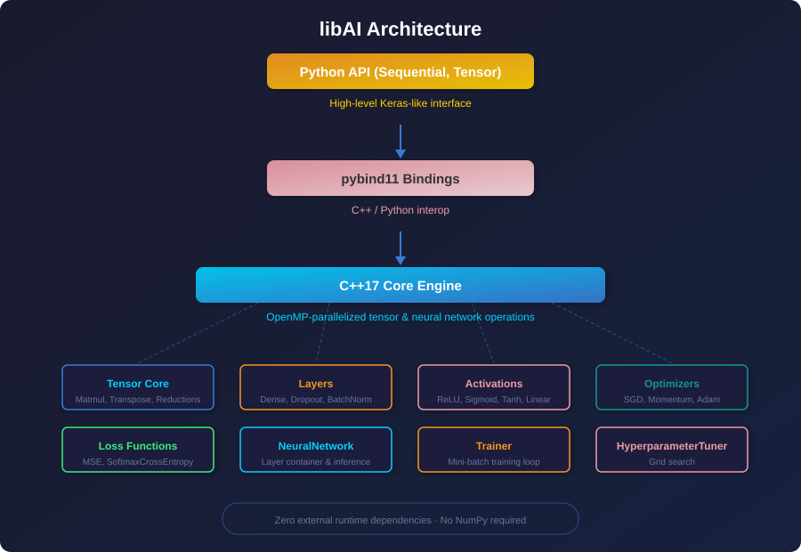

<p align="center">
  
</p>

<div align="center">

[](LICENSE)
[](https://isocpp.org/)
[](https://python.org)
[](https://openmp.org)
[](https://pybind11.readthedocs.io)
[](CMakeLists.txt)
[](https://github.com/Mo-Ha-0/libAI/pulls)

</div>

<p align="center">
  <b>libAI</b> is a high-performance <b>C++ neural network library</b> with <b>Python bindings</b>, built from scratch with zero external runtime dependencies — not even NumPy.
</p>

---

## 🎯 The Goal of Building the Library

I wanted to experiment with building a low-level framework so bad — to the point where I literally started without any planning. 😅

So this project started as an experimental journey into low-level framework design. I ported the core logic from my previous Python repository (`BeyondersTensorflow`) into C++ and implemented a custom tensor type from scratch to interact directly with memory and low-level optimizations.

In the future, **If Allah wills (إن شاء الله)**, I will intend to build a comprehensive, production-grade deep learning framework using C++ and, most likely, Rust. 🫡

### If you explore this framework and find it useful, please consider leaving a ⭐ and wishing me good luck! 🥹

---

## 📋 Table of Contents

- [Features](#-features)
- [Architecture](#-architecture)
- [Quick Start](#-quick-start)
- [Usage Examples](#-usage-examples)
- [API Overview](#-api-overview)
- [Building from Source](#️-building-from-source)
- [Project Structure](#-project-structure)
- [Requirements](#-requirements)
- [Performance](#-performance)
- [Contributing](#-contributing)
- [License](#-license)

---

## ✨ Features

<div align="center">
  
</div>

| Category                     | Components                                                        |
| ---------------------------- | ----------------------------------------------------------------- |
| **🧠 Layers**                | `Dense` (with He initialization), `Dropout`, `BatchNormalization` |
| **⚡ Activations**           | `ReLU`, `Sigmoid`, `Tanh`, `Linear`                               |
| **📉 Loss Functions**        | `MeanSquaredError`, `SoftmaxCrossEntropy` (numerically stable)    |
| **📈 Optimizers**            | `SGD`, `Momentum`, `AdaGrad`, `Adam`                              |
| **🏗️ Model API**             | Keras-like `Sequential`, low-level `NeuralNetwork`                |
| **🎯 Training**              | Mini-batch SGD with shuffling, validation, metrics history        |
| **🔬 Hyperparameter Tuning** | Grid search over arbitrary parameter spaces                       |
| **💾 Persistence**           | Binary model save / load (custom format)                          |
| **⚡ Parallelism**           | OpenMP multi-threading across all compute ops                     |
| **🐍 Python Bindings**       | Full C++ API exposed via pybind11 — no NumPy needed               |

---

## 🏗️ Architecture

<p align="center">
  
</p>

---

## 🚀 Quick Start

### Installation

```bash
git clone https://github.com/Mo-Ha-0/libAI
cd libAI
pip install pybind11 build
python -m build
pip install --force-reinstall dist/libai-*.whl
```

### Minimal Example

```python
import libAI as la

# Create random data
x = la.Tensor.random_normal([300, 2])
y = la.Tensor.zeros([300])
for i in range(300):
    y[i] = float(i % 3)

# Build Keras-like model
model = la.Sequential()
model.add(la.Dense(2, 64))
model.add(la.ReLU())
model.add(la.Dense(64, 64))
model.add(la.ReLU())
model.add(la.Dense(64, 3))
model.compile(optimizer='adam', loss='categorical_crossentropy')

# Train
model.fit(x, y, epochs=100, batch_size=32, verbose=True, print_every=20)

# Evaluate
print(f"Accuracy: {model.accuracy(x, y):.4f}")
```

---

## 📖 Usage Examples

### Python Sequential API

```python
import libAI as la

# Generate spiral classification data
n = 300
x = la.Tensor.zeros([n, 2])
y = la.Tensor.zeros([n])
for i in range(n):
    angle = (i % 3) * 2 * 3.14159 / 3
    r = 0.5 + (i % 3 - 1) * 0.3
    x[i, 0] = r * __import__('math').cos(angle)
    x[i, 1] = r * __import__('math').sin(angle)
    y[i] = float(i % 3)

# Define model
model = la.Sequential()
model.add(la.Dense(2, 64))
model.add(la.ReLU())
model.add(la.Dense(64, 64))
model.add(la.ReLU())
model.add(la.Dense(64, 3))
model.compile(optimizer=la.Adam(0.001), loss='categorical_crossentropy')

# Train with validation
model.fit(x, y, epochs=100, batch_size=32,
          validation_data=(x, y), verbose=True, print_every=20)

# Predict
preds = model.predict(x)
print(f"Accuracy: {model.accuracy(x, y):.4f}")
```

### Python Low-Level Tensor API

```python
import libAI as la

x = la.Tensor([[1.0, 2.0, 3.0], [4.0, 5.0, 6.0]])
w = la.Tensor.random_normal([3, 2])
y = x.matmul(w)

print("Input:", x.shape)    # [2, 3]
print("Weights:", w.shape)  # [3, 2]
print("Output:", y.shape)   # [2, 2]
print(y)
```

### C++ API

```cpp
#include <libAI/libAI.hpp>
using namespace libAI;

int main() {
    // Create data
    Tensor x_train({300, 2});
    Tensor y_train({300});
    // ... fill data ...

    // Build model
    NeuralNetwork model;
    model.add_layer<Dense>(2, 64);
    model.add_layer<ReLU>();
    model.add_layer<Dense>(64, 64);
    model.add_layer<ReLU>();
    model.add_layer<Dense>(64, 3);
    model.set_loss<SoftmaxCrossEntropy>();

    // Train
    Adam optimizer(0.001f);
    Trainer trainer(&model, &optimizer);
    auto history = trainer.fit(x_train, y_train, x_train, y_train,
                                200, 32, true, 20);

    // Evaluate
    float acc = model.accuracy(x_train, y_train);
    std::cout << "Accuracy: " << acc << std::endl;
    return 0;
}
```

---

## 📚 API Overview

### Tensor

| Method                              | Description                    |
| ----------------------------------- | ------------------------------ |
| `Tensor(shape)`                     | Create tensor with given shape |
| `Tensor(data)`                      | Create from nested list        |
| `t[i, j]` / `t[i]`                  | Indexing and slicing           |
| `t.matmul(other)`                   | Matrix multiplication          |
| `t.transpose()`                     | Full transpose                 |
| `t +, -, *, /`                      | Element-wise arithmetic        |
| `t.sum(axis)`, `t.mean(axis)`       | Reductions                     |
| `Tensor.random_normal(shape)`       | Random normal init             |
| `Tensor.glorot_uniform(shape)`      | Glorot uniform init            |
| `t.save(file)`, `Tensor.load(file)` | Binary persistence             |

### Layers

| Layer                  | Parameters                    |
| ---------------------- | ----------------------------- |
| `Dense(in, out)`       | Fully connected with He init  |
| `Dropout(rate)`        | Inverted dropout              |
| `BatchNormalization()` | Batch norm with running stats |

### Activations

| Activation  | Description         |
| ----------- | ------------------- |
| `ReLU()`    | `max(0, x)`         |
| `Sigmoid()` | `1 / (1 + exp(-x))` |
| `Tanh()`    | Hyperbolic tangent  |
| `Linear()`  | Identity            |

### Optimizers

| Optimizer                | Key Parameters       |
| ------------------------ | -------------------- |
| `SGD(lr)`                | Learning rate        |
| `Momentum(lr, mu)`       | Momentum coefficient |
| `AdaGrad(lr)`            | Adaptive gradient    |
| `Adam(lr, beta1, beta2)` | Adaptive moments     |

---

## 🛠️ Building from Source

### Using setuptools (Python wheel)

```bash
pip install pybind11 build
python -m build
pip install --force-reinstall dist/libai-*.whl
```

### Using Make (C++ examples)

```bash
make            # Build library + examples
make run_simple # Run simple classification example
make run_iris   # Run Iris dataset example
make clean      # Clean artifacts
```

### Using CMake

```bash
mkdir build && cd build
cmake ..
make
```

---

## 📁 Project Structure

```
libAI/
├── README.md                     # This file
├── LICENSE                       # Unlicense (public domain)
├── pyproject.toml                # Python build configuration
├── setup.py                      # pybind11 extension build script
├── CMakeLists.txt                # CMake build system
├── Makefile                      # Alternative Make build
│
├── include/libAI/                # C++ headers (public API)
│   ├── libAI.hpp                 # Aggregate header
│   ├── core/
│   │   ├── tensor.hpp            # Tensor class (header-only)
│   │   └── layer.hpp             # Base layer classes
│   ├── layers/
│   │   ├── dense.hpp             # Dense layer
│   │   ├── activations.hpp       # ReLU, Sigmoid, Tanh, Linear
│   │   ├── losses.hpp            # MSE, SoftmaxCrossEntropy
│   │   └── regularization.hpp    # Dropout, BatchNormalization
│   ├── optimizers/optimizers.hp  p # SGD, Momentum, AdaGrad, Adam
│   ├── network.hpp               # NeuralNetwork class
│   ├── trainer.hpp               # Trainer class
│   └── tuning.hpp                # HyperparameterTuner
│
├── src/                          # C++ implementation
│   ├── network.cpp
│   ├── trainer.cpp
│   ├── tuning.cpp
│   ├── layers/{dense,activations,losses,regularization}.cpp
│   └── optimizers/optimizers.cpp
│
├── bindings/
│   └── bindings.cpp              # pybind11 Python bindings
│
├── libAI/                        # Python package
│   ├── __init__.py               # Sequential API + re-exports
│   └── _libAI_core.pyi           # Type stubs
│
├── examples/
│   ├── simple_example.cpp        # Spiral classification (C++)
│   ├── iris_example.cpp          # Iris classification (C++)
│   ├── python_example.py         # Sequential API example
│   └── test_tensor.py            # Tensor test script
│
├── assets/                       # Images and diagrams
│   ├── logo.svg
│   ├── architecture.svg
│   └── tensor_ops.svg
│
└── dist/                         # Built Python wheels
    └── libai-*.whl
```

---

## 📋 Requirements

### Build-time

| Dependency     | Version                         | Purpose            |
| -------------- | ------------------------------- | ------------------ |
| C++17 compiler | GCC 8+ / Clang 10+ / MSVC 2019+ | Compile C++ source |
| OpenMP         | Any                             | Multi-threading    |
| pybind11       | >= 2.10                         | Python bindings    |
| Python         | >= 3.8                          | Bindings target    |
| setuptools     | >= 64                           | Python packaging   |

### Runtime

- **None.** No external dependencies. The compiled `.so` module is fully self-contained.

---

## ⚡ Performance

libAI leverages **OpenMP** to parallelize all compute-intensive operations:

- **Matrix multiplication** — parallelized across output rows
- **Element-wise operations** — parallelized across tensor elements
- **Reductions** (sum, mean, max) — parallelized with per-thread partial results
- **Layer forward/backward passes** — parallelized across batch samples
- **Training loop** — mini-batch gradient descent with automatic shuffling

> Performance scales with available CPU cores. The library is designed for CPU-based training and inference on multi-core systems.

---

## 🤝 Contributing

Contributions, bug reports, and feature requests are welcome! Feel free to:

- Open an [Issue](https://github.com/Mo-Ha-0/libAI/issues)
- Submit a [Pull Request](https://github.com/Mo-Ha-0/libAI/pulls)
- Star the repository ⭐

---

## 📄 License

This project is released into the **public domain** under the [Unlicense](LICENSE).

```
This is free and unencumbered software released into the public domain.

Anyone is free to copy, modify, publish, use, compile, sell, or
distribute this software, either in source code form or as a compiled
binary, for any purpose, commercial or non-commercial, and by any means.
```

---

<p align="center">
  Built with ❤️ and C++17 &bull; <a href="https://github.com/Mo-Ha-0/libAI">GitHub</a>
</p>
